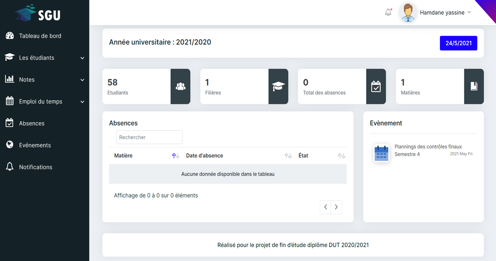

# SGU-University-management-system

## Overview

SGU (Système de Gestion Universitaire) is a comprehensive university management system designed to streamline administrative tasks, improve communication, and enhance overall efficiency in educational institutions. This web-based application provides a centralized platform for various stakeholders including administrators, department heads, professors, and students to interact and manage university-related tasks.



## Key Features

### User Roles
- Master: Has complete control over the system, including university structure management
- Administrator: Manages departments, professors, and students
- Department Head: Oversees department-specific tasks and professors
- Professor: Manages courses, grades, and absences

### Functionality
- Student Management
  - Enrollment
  - Grade management
  - Student transfers
- Professor Management
  - Course assignments
  - Absence tracking
  - Timetable management
- Department and Course Management
  - Create and modify departments, courses, and modules
  - Assign professors to courses
- Timetable Management
  - Create and update timetables for students and professors
- Absence Tracking and Make-up Class Scheduling
- Grade Management and Result Distribution
- Event Creation and Notification System
- Detailed Dashboards for each user role

### Technical Features
- Responsive web design
- Real-time notifications
- Data export (PDF, Excel)
- Secure authentication and authorization
- Database integration for persistent storage

## Technologies Used

### Backend
- Laravel (PHP Framework)
- MySQL Database

### Frontend
- HTML5
- CSS3
- JavaScript
- Bootstrap for responsive design
- jQuery
- Ajax for asynchronous requests

### Additional Libraries/Tools
- Laravel Excel for data export
- Pusher for real-time notifications
- Mailtrap for email testing in development
- Chart.js for data visualization

## Setup and Installation

1. Clone the repository:
   ```
   git clone https://github.com/Hamdane-yassine/SGU-University-management-system.git
   ```
2. Navigate to the project directory:
   ```
   cd SGU-University-management-system
   ```
3. Install PHP dependencies:
   ```
   composer install
   ```
4. Install JavaScript dependencies:
   ```
   npm install
   ```
5. Copy the `.env.example` file to `.env` and configure your environment variables:
   ```
   cp .env.example .env
   ```
6. Generate an application key:
   ```
   php artisan key:generate
   ```
7. Run database migrations:
   ```
   php artisan migrate
   ```
8. Seed the database with initial data:
   ```
   php artisan db:seed
   ```
9. Start the development server:
   ```
   php artisan serve
   ```

## Project Structure

The project follows Laravel's MVC architecture:
- `app/`: Contains the core code of the application
  - `Http/Controllers/`: Controllers that handle user requests
  - `Models/`: Eloquent models representing database tables
- `resources/views/`: Blade templates for the frontend
- `routes/`: Defines all routes for the application
- `database/`: Contains database migrations and seeders
- `public/`: Publicly accessible files (CSS, JavaScript, images)

## Authors

- EL GAOUT EL Mehdi
- DAOUDI Otman
- HAMDANE Yassine

## Acknowledgments

- Mr LASFAR Abdelali (Project Supervisor)
- École Supérieure de Technologie de Salé
- All contributors who have helped in testing and providing feedback

